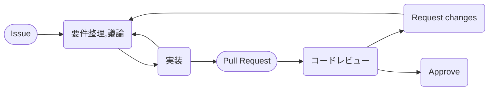

# コードレビューを受ける前に知っておきたい5つのこと

## はじめに

昨今、どの企業もコードの品質を維持するためにコードレビュー(あるいはそれに準ずること)をすると思います。  
私が属している部署でもコードレビューは活発に行われています。

本稿は、新人研修のコードやプロダクトコードをレビューしている際に、  
「コードレビューを受ける前にこういったことは先に理解していてほしいな」と思ったことをまとめました。

### コードレビューとは

コードレビューとは、**開発サイクルの中で他者がコードを査読するプロセス**です。  
本稿ではコードレビュー自体について言及はしませんが、より理解を深めたい方は、「[google-eng-practices-ja](https://fujiharuka.github.io/google-eng-practices-ja/ja/review/)」を読んでみてください。

### 想定プロセス

GitHub上でのコードレビューをイメージしています。(もちろん、どのサービスであろうと問題ありません)

次項から本題に入ります。

## 1. コードレビューは自身が困っていることを解決する場ではない

例えば`pull request`を出した際に、「実は~のような事に困っていてどうしたらいいですか？」のような話を混ぜていませんか？  
これが命名など軽微な質問であればそこまで問題になりませんが、設計などの質問であればどうでしょう？

プロダクトをチーム開発で開発していれば、必ず守るべき**期日**があります。  
コードレビューの多くはプロダクトに変更を加えるフェーズの終盤にあり、そこで設計などの根幹的な質問をすると期日に間に合わなくなります。  

何が言いたいかというと、戻りを減らすため自身が抱えている疑問は`pull request`を出す前にディスカッションしましょう。  
開発が難しかったり、すり合わせたいことがコード上に多くあるのであれば**ペアプロ**などのコラボレーションも良いでしょう。

コードレビュー時には、自身の観点においてマージ可能な状態になっていることが望ましいです。  
そのための必要な情報は早い段階で入手しましょう。

## 2. コードレビューに必要な情報を必ずレビュアーに共有する

大前提として、プログラマなのでコードで伝えられることはコードで伝えましょう。コード上の背景はコメントアウトなども駆使して伝えましょう。

それとは別の話で、例えばコミットログがすべて「commit」で`pull request`のカンバンにも目的が一切書かれていないような場合、レビュアーは全体像を把握しにくいといった類の話です。  
この例は大げさ(だといいが)ですが、大事な情報が共有されないままということはよくあると思います。

そのような暗黙知を表層化することがコードレビューの意義の一つであると思っています。  
コードだけに限らず、関連する思考プロセスやTipsは積極的に共有しましょう。

ちなみに、こういった共有をしないとレビュアーの負担が増えたり、コードレビュー自体が健全に行われなくなるので注意しましょう。

## 3. 書いたコードに責任を持つ

1.に近い話ですがコードレビュー時には、品質議論のため自身の観点においてマージ可能な状態になっていることが望ましいです。  
その「自身の観点においてマージ可能な状態」に持っていくためには、書いたコードに責任を持つ必要があります。

「責任を持つ」とはどういうことかというと、「説明責任を持つ」とほぼ同一と思ってもらって問題ありません。  
説明責任というと仰々しいですが、要するにそのコードを書いた理由を論理的に説明できれば良いわけです。

例えば、誰かがQiita記事で投稿しているコードをそっくりそのままコピペで流用したとします。  
そのコードをレビュアーが質問した際に、「記事にそういうサンプルコードがあったから」では説明になっていないわけですね。

プログラマとして、「なぜそのコードを書いたのか」を自分の言葉で説明できるようにしましょう。  
説明できるようになるには、例えば以下のようなことを継続していくことをおすすめします。  

- サンプルコードを模倣せずに一から実装する。
- 自身のコードを代替できる手法・アルゴリズムを探して比べる。
- 呼び出すライブラリのメソッド等の仕組みを調べる。

もちろん、工数内で出来る限りにとどめてください。無限に工数をかけることは誰も望んでいません。  
結局ある一定の時間を超えると一人で悩むより複数人で解決した方が早いです。  
書いたコードに責任を持つ意義は、**より良いコードを選択し、品質を維持すること**にあります。

## 4. 相手と対話する意識を持つ

コードレビュー問わず、開発サイクルを回す上で誰かとコミュニケーションを取ることは必須事項です。

例えば、「~はなぜそうなっていますか？」と尋ねた時に、「修正しました」のような回答が来るとそれはコミュニケーションエラーなわけです。  
また、コミュニケーションを取るうえでお互いが想定していることがズレているのようなことがあると、後日深刻な問題として表層化するでしょう。  
(こういうのをコンテキストがズレているというそうです)

上記のような事は、コードレビュー中にとても起こりやすいです。(議論が多くなるため)  
このようなことを防ぐために、まず2つのことを心がけて欲しいです。

1. 丁寧すぎるくらいに端折らずに内容を伝える。
2. 相手のなぜ・どうしてを意識して返答する。

1については、「主語」や「目的語」を端折ってお話ししないことを心がけて下さい。  
いい塩梅が分からなかったら相手がうんざりするくらい丁寧でいいと思います。  
お互い、主語や目的語があやふやだと感じたら、話のコンテキストを合わせるために色々確認してみましょう。

2については、相手感じている疑問を解決して議論を前に進めることを根底に持ってみてください。  
「なぜ・どうして」を解決するには、「5whys」とか「なぜなぜ分析」と呼ばれるロジカルシンキングが有効です。  
ロジカルに物事を深堀りできるようになると解決力が上がるかもしれません。

## 5. レビュアー(と開発者お互い)に感謝を伝える

これが一番大事です(マジです)。どんなにレビュアーに苛立ちを覚えても、貴重な時間を割いて自身と異なる観点を提供してくれることに感謝しましょう。  
レビュアーも同じです。開発者がチームに貢献してくれたことを感謝しましょう。

このことは、**心理的安全性**を確立する上でも大事です。有意義な議論をする上でお互いに、ある程度アツく話さなければならない時があると思います。  
そういった際に、「相手のことを尊重した上で話している」のとそうでないの場合とでは、話せるレベル感が変わってくると思います。

## おわりに

ざっくりですが、このようなことを意識するだけでコードレビューの時間がかなり有意義になります。  
ぜひ、心がけてみてください。
