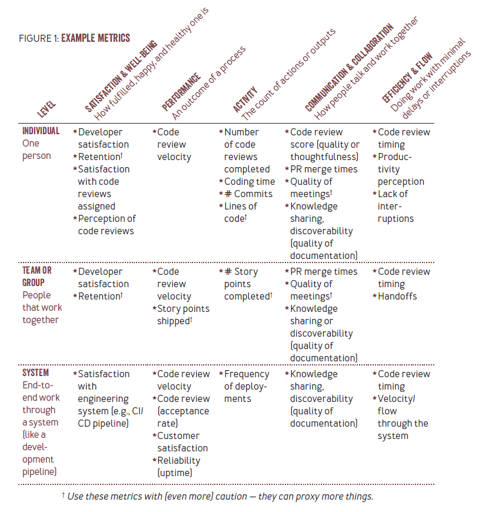

# The SPACE of Developer Productivity

開発者の生産性は複雑で微妙であり、ソフトウェア開発チームにとって重要な意味を持つ。 開発者の生産性を定義し、測定し、予測することを明確に理解することで、組織、管理者、開発者は、より高品質なソフトウェアを、より効率的に作ることができるようになる。

開発者の生産性は、広範囲にわたって研究されてきた。 しかし残念なことに、何十年にもわたる研究と実践的な開発経験にもかかわらず、開発者の生産性をどのように測定するか、あるいは開発者の生産性をどのように定義するかということについては、いまだに理解されていない。 チームやマネジャーが、開発者の生産性を単純なメトリクスで測定しようとして、“重要な1つのメトリクス”ですべてを捉えようとすることがあまりにも多い。

生産性の重要な尺度のひとつは、個人の認識である。 これは、生産性の高い日は「フロー」の中にいると主張する人々と共鳴するかもしれない。

また、開発者の生産性が必要なのは、エンジニアリングの成果を向上させるためだけでなく、開発者の幸福と満足を確保するためでもあり、生産性と満足度は複雑に関連しているという点でも一致している。

Covid-19の大流行により、世界中のソフトウェア開発者の大半が在宅勤務を余儀なくされ、開発者や管理者がいつもの職場やチームから切り離されたため、ソフトウェアシステムの効率的な開発と開発者の幸福を確保することがかつてないほど重要になっている。 これは予期せぬことであり、不幸なことではあるが、この変化は、統計学者が様々な異なる文脈における開発者の生産性を研究、比較、理解するために活用できる、稀な「自然実験」を構成している。 このような強制的な混乱と、将来的なリモートワーク/ロケーションワークのハイブリッドへの移行は、開発者の生産性と幸福を理解する必要性を加速させ、効率的かつ公平な方法でそれを行うことが重要であるという点で広く合意している。

この記事では、開発者の生産性に関するいくつかの一般的な神話や誤解について説明する。 これらの神話を暴露することから得られる最も重要なことは、生産性は単一の次元（または指標！）に還元することはできないということである。 このような神話が蔓延し、それを打ち破る必要があることから、私たちは実用的な多次元フレームワークを開発することにしました。 SPACEと呼ばれるこのフレームワークは、開発者の生産性の最も重要な次元である、満足度と幸福度、パフォーマンス、アクティビティ、コミュニケーションとコラボレーション、効率性とフローを捉えている。 単一の次元だけでなく、より多くの次元で生産性を認識し測定することで、チームや組織は人やチームの働き方をよりよく理解し、より良い意思決定を行うことができる。

この記事では、このフレームワークが実際の生産性を理解するためにどのように使用できるのか、また、なぜこのフレームワークを使用することで、チームが開発者の生産性をよりよく理解し、作業やチームに情報を提供するためのよりよい尺度を作成することができるのか、そして、エンジニアリングの成果や開発者の幸福にプラスの影響を与える可能性があるのかを示している。

## 開発者の生産性に関する神話と誤解

開発者の生産性に関する多くの神話が、長年にわたって蓄積されてきた。 これらの誤解を認識することは、生産性の測定に対する理解を深めることにつながります。

### 💡 神話：生産性は開発者の活動がすべてである

これは最も一般的な神話の1つで、望ましくない結果や開発者の不満を引き起こす可能性がある。 長時間労働は、開発者が悪いシステムを克服するために “力技”で仕事をこなさなければならなかったり、事前に定義されたリリーススケジュールに間に合わせるための計画が甘かったりすることを意味するかもしれない。 一方、活動量の増加は、より良いエンジニアリングシステムを反映し、開発者が効率的に仕事をするために必要なツールを提供したり、チームメンバーとのコラボレーションやコミュニケーションが改善され、変更やコードレビューのブロックが外れたりする可能性がある。

アクティビティメトリックスだけでは、これらのうちどれが該当するのかを明らかにすることはできないため、開発者に報酬を与えるため、あるいはペナルティを与えるために、単独で使用するべきではありません。 プルリクエスト数、コミット数、コードレビュー数といったわかりやすいメトリクスでさえ、データのギャップや測定エラーによって誤差が生じやすい。 最後に、開発者は納期に間に合わせるために時間を融通し合うことが多く、生産性を評価する上で特定の活動指標を信頼することは難しい。

### 💡 神話：生産性とは個人のパフォーマンスだけである

個人のパフォーマンスも重要だが、チームの成功に貢献することも生産性を測る上で重要である。 開発者、チーム、組織のバランスをとるパフォーマンスの尺度が重要である。チームスポーツと同様に、成功は選手の個人的なパフォーマンスとチームの成功の両方によって判断される。 自分個人の生産性のためだけに最適化する開発者は、チームの生産性を損なうかもしれない。 コードレビュー、オンコールローテーション、エンジニアリングシステムの開発・管理など、よりチームにフォーカスした活動は、コードベースと製品・サービスの品質維持に役立つ。 個人、チーム、組織の生産性を最適化するための適切なバランスを見つけること、そしてトレードオフの可能性を理解することが重要である。

### 💡 神話：1つの生産性指標ですべてがわかる

開発者の生産性に関する一般的な神話の1つは、普遍的な指標を生み出し、この「重要な1つの指標」を使って、チームの仕事全体を採点し、組織全体、さらには業界全体でチームを比較することができるというものだ。 これは真実ではない。生産性は、仕事のいくつかの重要な側面を表しており、仕事が行われるコンテキストに大きく影響されます。

### 💡 神話：生産性測定は管理者にしか役に立たない

開発者は、生産性測定は役に立たないとよく言う。 これは、リーダーや管理職による尺度の誤用に起因している可能性があり、生産性の測定や実行が不十分な場合、組織において不適切な使われ方をする可能性があることは事実です。 生産性がこのように共同利用されていることは残念だが、開発者が自分自身の生産性を追跡することに価値を見出していることに注目することは重要だ。

開発者の生産性は個人的なものであることを念頭に置くことで、開発者は自分の仕事に関する洞察を得るために生産性を活用し、自分の時間、エネルギー、そして日々をコントロールできるようになる。 生産性を向上させる方法を見つけることは、開発者の一日に喜びをもたらし、フラストレーションを減らす方法を見つけることでもある。

### 💡 神話：生産性はエンジニアリング・システムと開発者ツールだけの問題である。

開発ツールやワークフローは開発者の生産性に大きな影響を与えるが、環境や職場文化といった人的要因も大きな影響を与える。 環境や文化を健全に保つために必要な重要な作業は、組織の多くのメンバーや、従来生産性を測定するために使われてきた指標からは「見えない」ことがよくある。 モラール醸成、メンタリング、知識の共有といった仕事は、生産性の高い職場環境を支えるために不可欠であるにもかかわらず、測定されないことが多い。 チーム全体の生産性を向上させる「見えない」仕事も、一般的に測定される他の側面と同様に重要である。

## SPACE: 開発者の生産性を理解するためのフレームワーク

生産性は、個人やエンジニアリングシステム以上のものであり、単一の指標や活動データだけでは測定できない。 SPACEフレームワークは、生産性のさまざまな側面を捉えるために開発された。 このフレームワークは、生産性をより大きな空間の中で合理的に考える方法を提供し、測定基準を注意深く選択することで、それらの測定基準が何を意味するかだけでなく、単独で使用した場合や間違った文脈で使用した場合の限界も明らかにする。

### Satisfaction and well-being

満足度とは、開発者が自分の仕事、チーム、ツール、文化にどれだけ充実感を感じているかということであり、 幸福度とは、開発者がどれだけ健康で幸せであるか、そして自分の仕事がそれにどのような影響を与えているかということである。 例えば、生産性と満足度は相関関係にあり、満足度が生産性の先行指標となる可能性がある。

例えば、パンデミックの間、多くの場所で在宅勤務が義務化されたとき、生産性のいくつかの尺度（例えば、コードのコミットやプルリクエストをマージする速度）で上昇した8。 しかし、定性的データは、一部の人々が幸福感に苦しんでいたことを示している3。 これは、生産性のいくつかの側面を捉えるバランスのとれた尺度の重要性を強調している：このことは、生産性のいくつかの側面をとらえるバランスのとれた尺度の重要性を浮き彫りにしている。 いくつかの活動指標はポジティブに見えるが、満足度の追加指標はより全体的な絵を描き、生産性は個人的なものであり、一部の開発者は燃え尽き症候群に近づいていることを示している。 これに対処するために、大組織のいくつかのソフトウェアグループは、「メンタルヘルス」デー、つまり、人々が燃え尽き症候群を回避し、幸福感を向上させるための自由な休日を導入した。

満足度と幸福度が生産性の重要な側面であることは明らかである。これらの性質は、多くの場合、調査によって把握するのが最善である。満足の次元を評価するには、以下のような項目を測定するとよいだろう：

- 従業員の満足度。従業員の満足度、および従業員が自分のチームを他の人に推薦するかどうか。
- 開発者の効力。開発者が仕事を遂行するために必要なツールやリソースを持っているかどうか。
- 燃え尽き症候群。職場の過度かつ長期的なストレスによる疲労。

### Performance

パフォーマンスとは、システムやプロセスの成果である。ソフトウェア開発者のパフォーマンスを定量化するのは難しい。 なぜなら、個人の貢献を製品の成果に直接結びつけるのは難しいからである。大量のコードを生産する開発者は、高品質のコードを生産していないかもしれない。 高品質のコードが顧客価値を提供するとは限らない。顧客を喜ばせる機能が、必ずしもプラスのビジネス成果につながるとは限らない。 たとえ特定の開発者の貢献がビジネス成果に結びついたとしても、その開発者が、よりインパクトのある仕事を選択する権限を持っていたのではなく、よりインパクトのない仕事を割り当てられていた可能性があるため、必ずしもパフォーマンスを反映しているとは限らない。 さらに、ソフトウェアは多くの開発者の貢献の総体であることが多く、個々の開発者のパフォーマンスを評価することが難しくなっている。多くの企業や組織では、ソフトウェアは個人ではなくチームによって書かれる。

このような理由から、性能はしばしば、出力ではなく成果として評価するのが最適である。 ソフトウェア開発者のパフォーマンスを最も単純化すると、「開発者が書いたコードは、それが行うべきことを確実に実行したか？パフォーマンスの次元をとらえるメトリクスの例としては、以下のようなものがあります：

- 品質。信頼性、バグのなさ、継続的なサービスの健全性。
- 影響。顧客満足度、顧客導入と維持、機能利用、コスト削減。

### Activity

アクティビティとは、業務遂行の過程で完了したアクションやアウトプットの数である。 開発者のアクティビティは、正しく測定されれば、開発者の生産性、エンジニアリングシステム、およびチームの効率について、貴重ではあるが限定的な洞察を提供することができる。 開発者が行う活動は複雑で多様であるため、その活動を測定したり定量化したりすることは容易ではありません。 実際、エンジニアリングシステムや環境全体にわたって、開発者の活動のすべての側面を包括的に測定し、定量化することはほとんど不可能です。 しかし、よく設計されたエンジニアリング・システムであれば、ソフトウェア開発ライフサイクルのさまざまなフェーズに沿ったアクティビティ・メトリクスを取得し、 開発者のアクティビティを大規模に定量化するのに役立ちます。 比較的容易に測定・定量化できる開発者の活動には、次のようなものがある：

- 設計とコーディング。設計文書や仕様書、作業項目、プルリクエスト、コミット、コードレビューの量や数。
- 継続的インテグレーションとデプロイメント。ビルド、テスト、デプロイ/リリース、インフラの利用回数。
- 運用活動。インシデント／問題の数または量、およびその重大度、オンコールへの参加、およびインシデントの軽減に基づく分布。

これらのメトリクスは、扱いやすい開発者の活動を測定するためのウェイポイントとして使用することができますが、 既知の限界があるため、個人やチームの生産性に関する意思決定を行うために単独で使用すべきではありません。 これらのメトリクスは、まずテンプレートとして使用し、組織のニーズや開発環境に応じてカスタマイズする必要があります。 先に述べたように、ソフトウェア開発に不可欠な多くの活動は、扱いにくいものである （例えば、チームミーティングへの出席、ブレーンストーミングへの参加、他のチームメンバーが問題に遭遇したときの支援、アーキテクチャのガイダンスの提供など）。

### Communication and collaboration

コミュニケーションとコラボレーションは、人々やチームがどのようにコミュニケーショ ンし、どのように協働するかを捉えるものである。 ソフトウェア開発は、チーム内およびチーム間の広範かつ効果的なコミュニケーショ ン、調整、コラボレーションに依存する、協調的かつ創造的なタスクである。 さらに、チーム内およびチーム間の情報の流れ方は、業務の効果的な調整と統合に必要な文書の可用性と発見可能性に影響を与えます。 より効果的なチームは、適切な問題に取り組み、新しいアイデアのブレーンストーミングに成功しやすく、あらゆる選択肢の中からより良い解決策を選択する。

チームの成果に貢献する作業や、他のチームメンバーの生産性をサポートする作業は、個人の生産性やフロー状態に入る能力を犠牲にする可能性があり、モチベーションや満足度を低下させる可能性がある。 しかし、効果的なコラボレーションは、個人的な活動の必要性（不必要なコードレビューや手直しなど）を低下させ、 システムのパフォーマンスを向上させ（プルリクエストのマージが速くなれば、バグを回避して品質を向上させることができる）、 生産性を維持し、燃え尽き症候群を回避（または逆に、正しく行われなければ、燃え尽き症候群を増加）させることができる。

しかし、チームの生産性やチームメンバーの期待を理解し、測定することは、 目に見えない作業や、チームのタスクを調整し、計画するための明確な作業18など、測定することが難しい項目があるため、複雑である：

- 文書や専門知識の発見可能性。
- 仕事の統合の早さ。
- チームメンバーが貢献した仕事のレビューの質。
- 誰が誰とどのようにつながっているかを示すネットワーク指標。
- 新メンバーのオンボーディング時間と経験。

### Efficiency and flow

最後に、効率とフローとは、個人であれシステムであれ、中断や遅延を最小限に抑えながら仕事を完了させたり、進捗させたりする能力のことである。 これには、チーム内およびチーム間の活動がどれだけうまく組織化されているか、継続的な進捗がなされているかなどが含まれる。

この生産性の概念化は、多くの開発者が仕事をするときに「フローに入る」こと、あるいはフローを見つけ最適化することの難しさについて語るときにも繰り返される。 個人の効率性は、中断のない集中時間や、価値創造アプリ内の時間（例えば、開発者が統合開発環境で過ごす時間は、「生産的」な時間とみなされる可能性が高い）によって測定されることが多い。

チームやシステムレベルでは、効率性はバリューストリームマッピングに関係する。 バリューストリームマッピングは、ソフトウェアをアイデアや作成から最終顧客に提供するまでに必要なステップを把握するものである。 バリューストリームの流れを最適化するには、遅延とハンドオフを最小限に抑えることが重要である。 DORA（DevOps Research and Assessment）フレームワークは、チーム内のフローを監視するためのいくつかのメトリクスを導入した。 例えば、デプロイ頻度は、組織が本番環境へのリリースに成功する頻度を測定し、変更のリードタイムは、コミットが本番環境に入るまでにかかる時間を測定する。

システムを介した変更のフローに加えて、知識と情報のフローも重要である。 効率とフローのある側面は測定が難しいかもしれないが、多くの場合、価値の流れにおける非効率を発見し、取り除くことは可能である。 顧客やユーザーにとって何の価値も生み出さない活動は、しばしばソフトウ ェア開発の無駄と呼ばれる。 例えば、重複作業、作業が正しく行われなかったため の手戻り作業、時間のかかる暗記作業などである。

効率とフローの次元を把握するためのメトリクスの例としては、以下のようなものがある：

- プロセス内のハンドオフ数、プロセス内の異なるチーム間のハンドオフ数。
- フローに留まり、仕事を完了する知覚能力。
- 中断：量、タイミング、間隔、開発作業とフローへの影響。
- システムを通じた時間測定：合計時間、付加価値時間、待ち時間。

効率性は、SPACEのすべての次元に関連している。 個人、チーム、およびシステムレベルでの効率性は、満足度の向上と正の相関があることが判明している。 しかし、効率性の向上は、他の要因に悪影響を及ぼす可能性もある。 たとえば、フローとスピードを最大化すると、システムの品質が低下し、顧客に見えるバグの数（パフォーマンス）が増加する可能性がある。 中断を減らして個人の効率を最適化すると、共同作業の能力が低下し、他の人の作業が妨げられ、チームのブレーンストーミング能力が低下する可能性がある。

## フレームワークの実際

SPACEのフレームワークを説明するために、図1に5つの次元のそれぞれに該当する具体的な指標を示す。 この図には、個人レベル、チームまたはグループレベル、システムレベルの指標の例が示されている。これらの測定基準について、以下3つの簡単な議論を行う： まず、コードレビューに関するメトリクスの例を示し、その定義とプロキシ次第で、SPACEフレームワークのすべての次元をカバーできることを示す。 次に、フレームワークの2つの次元（アクティビティ、効率とフロー）について、追加の例を示す。 このセクションは、開発者の生産性を全体的に理解するためにメトリクスを組み合わせるというフレームワークの使用方法についての議論と、注意事項で締めくくられている。 付属のサイドバーでは、インシデント管理における生産性を理解するために、フレームワークをどのように使用できるかを示している。

どのように枠組みを設定し、どのメトリクスを使用するかによって、SPACEフレームワークの5つの次元すべてをカバーすることができるメトリクスのセットを提示することができるシナリオの例として、コードレビューから始めましょう：

- 満足度。コードレビューに関する知覚的な測定は、開発者がその作業を良いものとして見ているか悪いものとして見ているかを明らかにすることができる。 なぜなら、開発者一人あたりのコードレビューの回数は、不満のシグナルになるかもしれないからです。
- パフォーマンス。コードレビューのベロシティは、レビューのスピードを表します。 これは、個人のレビュー完了の早さとチームの制約の両方を反映することができるため、個人レベルとチームレベルの両方の指標となります。 (例えば、個人は割り当てを受けてから1時間以内にレビューを完了させることができますが、チームは、チームメンバー全員が変更案を見ることができるように、 すべてのレビューを24時間オープンにしておくというポリシーを持つことができます)。
- 活動。完了したコードレビューの数は、与えられた時間枠の中でどれだけのレビューが完了したかを把握する個々のメトリクスであり、最終的な成果物に貢献する。
- コミュニケーションとコラボレーション。コードレビューそのものは、開発者がコードを通じてコラボレーションする方法であり、 コードレビューの品質や思慮深さを測る尺度やスコアは、コラボレーションとコミュニケーションの優れた定性的尺度です。
- 効率とフロー。コードレビューは重要だが、ワークフローを中断したり、遅延によってシステムに制約が生じたりすると、問題を引き起こす可能性がある。 同様に、コードレビューを待たなければならないことは、開発者の作業継続を遅らせる可能性がある。 コードレビューをバッチ化することで、開発者のコーディング時間を中断させない（これは個々の指標に影響する）一方で、システムのスループットに遅延を生じさせない（これはシステムの指標に影響する）ため、チームは効率的にコードを提供できる（チームレベルの指標）。 したがって、コードレビューのタイミングが個人、チーム、システムの効率とフローに与える影響を測定することが重要である。 これは、レビュー完了までの時間や中断の特徴（タイミングや頻度など）を把握する知覚測定や遠隔測定によって行うことができる。

SPACEのフレームワークを、(1)活動、(2)効率とフローの次元でさらに深く検討してみよう。 この例では、アクティビティ指標は、コミット数、コーディング時間（費やした合計時間または1日の時間帯）、完了したコードレビュー数という個人レベルの指標である。 これらの指標は、最終製品に直接貢献する作業を最もよく表しており、作業パターンや行動は、開発者が働くチームや環境に影響されることを理解している。

## フレームワークの使い方

開発者の生産性を測定するために、チームやリーダーは（そして個人でさえも）、フレームワークの複数の次元にわたって複数のメトリクスを取得する必要があります。 例えば、すでにコミット数（アクティビティ指標）を測定している場合、プルリクエスト数とコーディング時間を単にメトリクスダッシュボードに追加してはいけません。 これらを追加することで、生産性のアクティビティ次元を把握する方法を丸めることができますが、生産性を本当に理解するためには、2つの異なる次元から少なくとも1つのメトリクスを追加してください。

もう一つの推奨は、少なくとも一つの評価指標に、調査データなどの知覚的尺度を含めることである。 人々の生活経験に関する知覚を含めることで、生産性のより完全な全体像を構築することができる。 多くの場合、知覚データは、システム動作の計測だけから観察できるものよりも、より正確で完全な情報を提供するかもしれない。

多次元・多タイプの測定基準を含めると、多くの場合、緊張関係にある測定基準が生み出されます。 なぜなら、バランスの取れたビューは、作業とシステムで何が起きているかを正しく把握することができるからです。 このようにバランスの取れたビューは、チームメンバー間で、よりスマートな意思決定とトレードオフを強化するのに役立ちます。

その一例が、アジャイル開発プロセスでチームレベルの進捗を評価するためによく使われる指標であるストーリーポイントである。 もしチームがストーリーポイントだけで評価されると、メンバーは自分のポイントを最適化することに集中し、 他の開発者の進捗や、他のチームとのコラボレーションや将来の開発者の受け入れという意味であれば会社にとって重要な、目に見えない可能性のある仕事を完了することを犠牲にすることになる。 また、もしリーダーが開発者に迅速な作業能力について質問することなく、ストーリーポイントを使用して進捗を測定した場合、 何かがうまくいかず、チームが回避策を講じて燃え尽きているのか、新しいイノベーションが特にうまくいっており、苦戦している他のチームを助けるために使用できるのかを特定することができなくなる。

このことは、メトリクスとそれがチームや組織に及ぼす影響についての重要なポイントにつながる： メトリクスは、何が重要かを示すものなのだ。組織で何が重要かを間接的に知る方法の一つは、何が測定されているかを見ることである。 例えば、従業員の健康、幸福、定着率に気を配っている企業は、生産性の測定に満足度や幸福度の次元を含めるだろう。 補足すると、測定基準を追加したり削除したりすることで、行動を促すことができる。

たとえば、「生産性＝コード行数」だけのチームと、「生産性＝コード行数＋コードレビューの質＋顧客満足度」のチームとでは、大きく異なる。 この場合、生産性とアウトプットに関する（問題はあるが、おそらく埋め込まれている）指標は維持したまま、生産性に関する認識を、 （思慮深いコードレビューを評価することによって）チームワークと（顧客満足を評価することによって）エンドユーザーの両方をも評価する方向に誘導している。

メトリクスは行動を形成するので、たった2つのメトリクスを追加し、評価することで、あなたはチームと組織の変化を形成する手助けをしたことになる。 これが、フレームワークの複数の次元から必ず引き出すことが非常に重要な理由です： そうすることで、チームレベルとシステムレベルの両方で、より良い結果を導くことができます。 この例では、チームが改善と反復を続けるにつれて、活動指標であるコード行数をコミット数などに置き換えることができる。

## 注意すべき点

フレームワークが役立つためには、すべての次元を含める必要はありません。 例えば、開発者やチームに広範なメトリクスと改善目標のリストが提示された場合、それらを達成することが達成不可能なゴールのように感じられるかもしれません。 このことを念頭に置いて、生産性の良い尺度は、少なくとも3つの次元にわたる少数のメトリクスで構成されることに注意してください。

どのような測定パラダイムも慎重に使用されるべきである。測定基準の中には、ノイズの多い近似値であるため、測定に適さないものもある（図1にいくつかの例を示す）。 リテンションは、従業員の満足度を測定するためによく使われますが、これは満足度をはるかに超えるものであり、報酬、昇進の機会、チームに関する問題、あるいはパートナーの移動さえも反映することがあります。 チームレベルでは、自分のリテンション評価を守るために異動を阻止するマネージャーもいるかもしれません。 仮にリテンションが満足度を反映していたとしても、それは遅行指標であり、チームは手遅れになるまでシフトに気づかない。 ストーリーポイントの使用には限界があることは、別の記事で述べたとおりである 。 ストーリーポイントは、重要なプロジェクトでの共同作業を犠牲にしてでも、自分たちの仕事に集中するインセンティブをチームに与える可能性がある。

チームや組織は、開発者のプライバシーに配慮し、チームやグループレベルでの匿名化された集計結果のみを報告する必要があります。 (しかし、個人レベルの生産性分析は、開発者にとって有益かもしれません。 例えば、以前の調査によると、開発者の典型的な作業シフトは開発のフェーズによって異なり、開発者は1日の中でより生産性の高い時間帯を持っている可能性がある。

最後に、どのような測定パラダイムも、バイアスや規範をチェックす べきである。 これらは外部からの影響であり、測定値を変化させたり影響を与えたりする可能性がある。 ここにいくつかの例を挙げるが、すべてを網羅しているわけではないので、すべてのチームは、データに存在する可能性のある外部からの影響を探し、考えることが推奨される：

- ピアレビューと性別。調査によると、女性はコードレビューで否定的なコメントを受けやすく、肯定的なコメントを受けにくい。 たとえあなたの組織やチームにそのようなパターンがなくても、開発者はより広い技術業界の影響を受けている可能性が高いことを理解してください。 これらの影響を考慮に入れてください。
- 時間をまたいだ尺度の正規化。チームは、時間を正規化する方法、特に長期にわたって正規化する方法に注意する必要があります。 例えば、1年間の指標を見ることは、育児休暇取得者にバイアスをかけることになります。
- 知覚的測定。チームや組織は、文化的規範に留意し、それを受け入れるべきです。 ある文化圏では当然、高い報告がなされ、ある文化圏では低い報告がなされます。 知覚的尺度が信用できないということではなく、異なる文化圏の尺度はベースラインが異なるので、互いに比較すべきではないということです。

## なぜ今なのか

開発者の生産性は、個人の活動レベルや、ソフトウェアを出荷するために依存するエンジニアリングシステムの効率性以上のものであり、単一のメトリックや次元で測定することはできません。 私たちは、生産性のさまざまな側面を捉えるためにSPACEフレームワークを開発しました。 このフレームワークがなければ、生産性に関する広範で潜在的に有害な神話が存続する可能性があるからです。

SPACEフレームワークは、生産性をより大きな空間で論理的かつ体系的に考え、目標にリンクしたバランスの取れた指標を注意深く選択する方法を提供する。 このフレームワークは、すぐには明らかにならないトレードオフを明らかにし、 目に見えない作業や、開発者の未達成や全体的なフローや効率性の乱れを犠牲にして活動が測定された場合の作業の増加など、変化によるノックオン効果を説明するのに役立つ。

生産性を総合的に理解し測定する必要性は、かつてないほど高まっている。 Covid-19の大流行によって仕事が中断され、在宅勤務への急激な転換がもたらされたとき、多くの人が生産性への影響を疑問視し、この変化をどのように理解し、測定すべきかという問題を提起した。 世界が徐々に「新しい日常」に戻っていく中で、SPACEフレームワークは、将来の変化が提案され、実行される際に考慮すべき重要な生産性の次元を捉えている。 このフレームワークは、個人、チーム、組織が、生産性の全体像を示す適切な指標を特定するのに役立つことを意図している。 これは、生産性に関するより思慮深い議論と、よりインパクトのあるソリューションの設計につながる。
